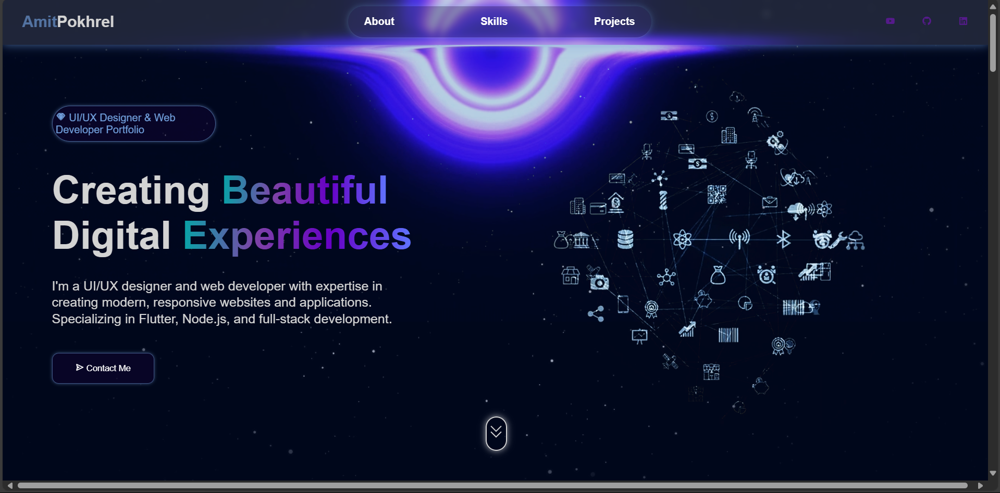
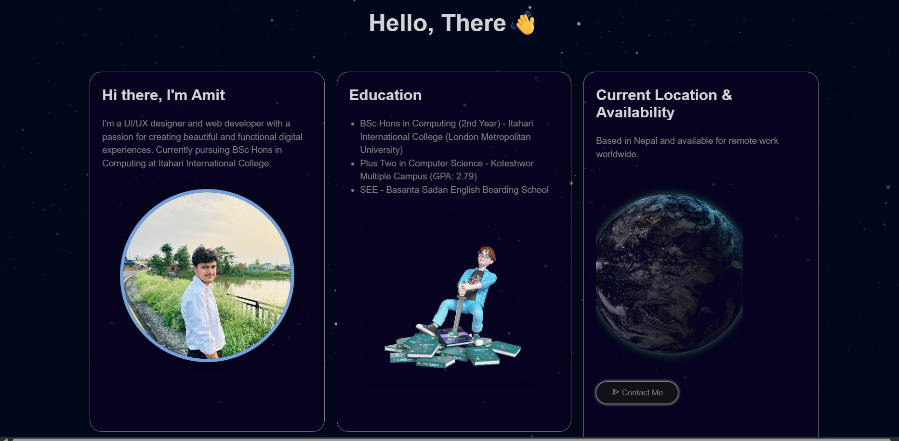

## Hi, This is my personal portfolio here. 
# Amit Pokhrel - UI/UX Designer & Web Developer Portfolio 🌐

Welcome to my personal portfolio website! This site showcases my projects, skills, education, and passion for creating modern and meaningful digital experiences.

## 🔗 Live Preview
You can view the live portfolio here: https://ameetpokhrel02.github.io/Personal_Portfolio/

---

## 🧑‍💻 About Me

Hi! I'm **Amit Pokhrel**, a passionate UI/UX designer and full-stack web developer currently pursuing BSc Hons in Computing. I love combining design and development to build beautiful and functional web apps.

---

## 🛠️ Tech Stack

- **Frontend:** HTML, CSS, JavaScript.
- **Tools:** VS Code, Git, Figma, Adobe XD
- **Others:** AOS (Animate on Scroll), Boxicons

---



## 📁 Project Structure

```bash
.
├── index.html              # Main HTML file
├── style.css               # CSS styles
├── app.js                  # JavaScript for interactivity
├── /videos                 # Background & project videos
├── /images                 # Profile and project images
├── /fonts (optional)       # Custom fonts if used
├── README.md               # Project documentation


